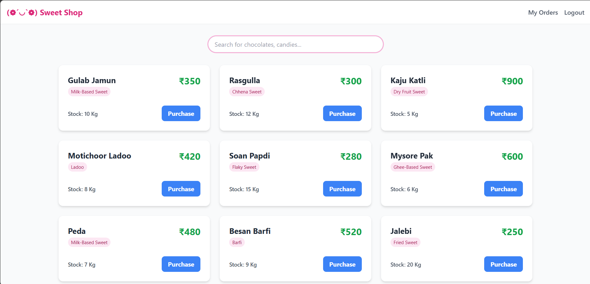
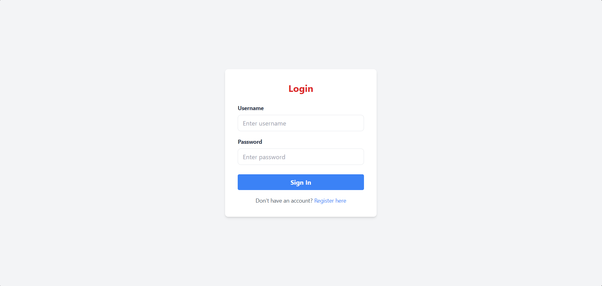
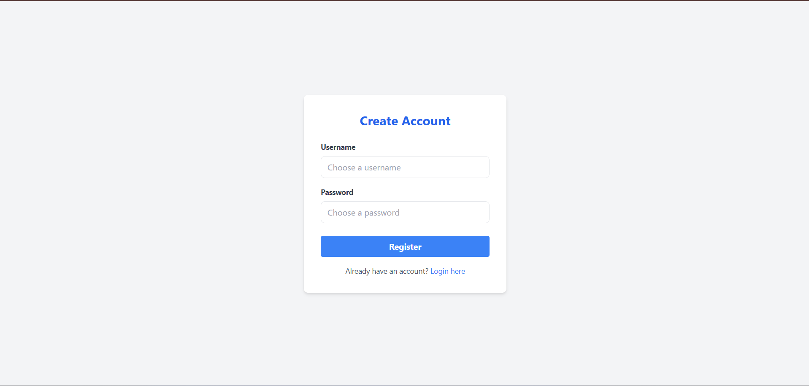
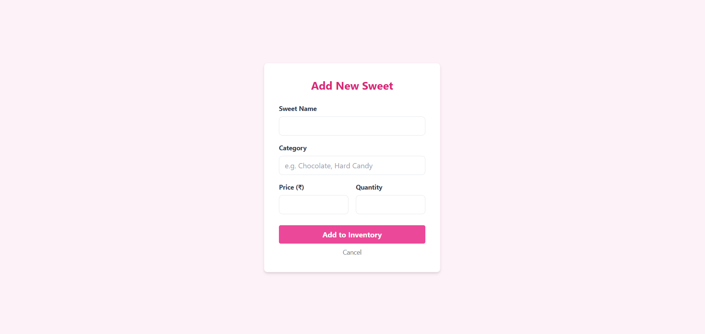
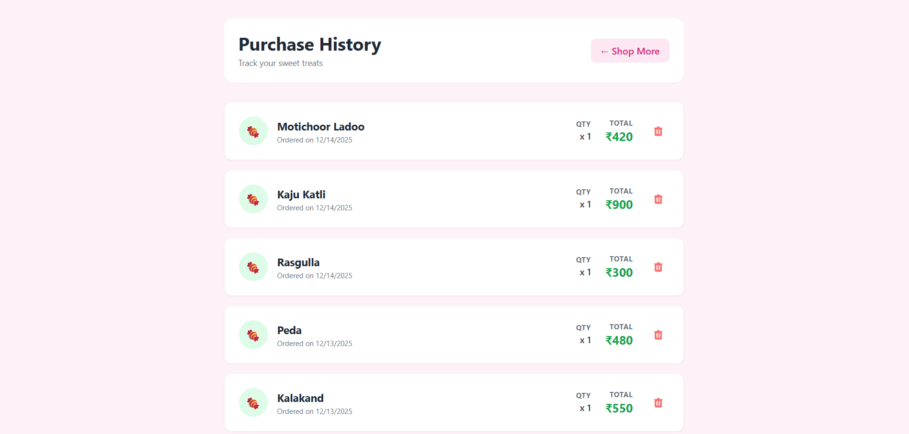
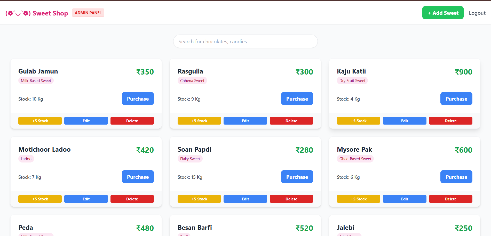

# 🍬 Sweet Shop Management System

## Objective
Design, build, and test a full-stack Sweet Shop Management System. This project demonstrates skills in API development, database management, frontend implementation, testing, and modern workflows with AI-assisted coding.

## 🚀 Live Demo
* **Frontend (Vercel):** [Insert your Vercel Link Here]
* **Backend (Render):** [Insert your Render Link Here]

## 🛠️ Tech Stack
* **Frontend:** React (Vite), Tailwind CSS, React Router DOM
* **Backend:** Node.js, Express.js
* **Database:** MongoDB Atlas (Mongoose ORM)
* **Authentication:** JSON Web Tokens (JWT)
* **Testing:** Jest + Supertest
* **Deployment:** Vercel (Client) & Render (Server)

## ✨ Features
* **User Authentication:** Secure Login and Registration system.
* **Role-Based Access:**
    * **Users:** Can view sweets, search/filter, and manage their own orders.
    * **Admins:** Can add new sweets, restock inventory, update prices, and delete items.
* **Smart Dashboard:** Real-time stock updates; "Purchase" button disables automatically when out of stock.
* **Responsive Design:** Fully responsive UI built with Tailwind CSS.

## 📸 Application Screenshots

| Dashboard | Login Screen | Register |
|:---:|:---:|
|  |  |  |

| Add Sweet (Admin) | MyOrders | Admin Panel |
|:---:|:---:|:---:|
|  |  |  |

## ⚙️ Setup Instructions

### 1. Backend Setup
cd server
npm install
# Seed the database with initial sweets (Optional)
node seed.js
npm start

DB_CONNECT=mongodb+srv://<username>:<password>@cluster.mongodb.net/sweetshop?retryWrites=true&w=majority
TOKEN_SECRET=your_super_secret_jwt_key
PORT=5000

### 2. Frontend
cd client
npm install
npm run dev

### 3. Testing
cd server
npm run test

## 4. API Endpoints

| Method | Endpoint | Description | Access |
| :--- | :--- | :--- | :--- |
| `POST` | `/api/auth/register` | Register a new user | Public |
| `POST` | `/api/auth/login` | Login and receive Token | Public |
| `GET` | `/api/sweets` | Get all sweets | Public |
| `GET` | `/api/sweets/my/orders` | View user purchase history | User |
| `POST` | `/api/sweets` | Add a new sweet | Admin |
| `PUT` | `/api/sweets/:id` | Update sweet details | Admin |
| `DELETE` | `/api/sweets/:id` | Remove a sweet | Admin |
| `POST` | `/api/sweets/:id/purchase` | Buy a sweet (Decreases stock) | User |
| `POST` | `/api/sweets/:id/restock` | Add stock (+5) | Admin |

### My AI Usage
## AI Tools Used
ChatGPT (Primary thought partner and code assistant)

How I Used Them
Red-Green-Refactor (TDD) Workflow:

I used ChatGPT to guide me through the Red-Green-Refactor cycle for the backend logic.

Specifically, I asked the AI to generate initial failing tests (Red) for the sweet calculation logic and inventory limits.

Once the tests were established, I used the AI to help brainstorm the minimal code required to make those tests pass (Green).

Frontend Development & Integration:

I leveraged AI to accelerate the creation of React components, specifically the Login.jsx and Register.jsx forms with Tailwind styling.

I used AI to debug complex connectivity issues between the frontend and backend, specifically resolving CORS errors and configuring Environment Variables (API_URL) for production deployment.
